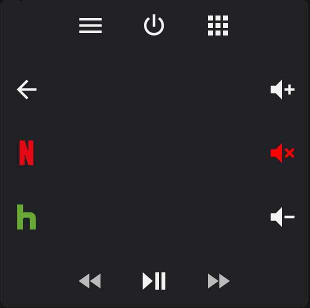

# swipe-navigation-card
A card that allows you to control your media devices by using swipe gestures and buttons. This card is similar to the Xbox app's swipe navigation remote control.


## Features
Please let me know of any new features that you would like to have! For example the ability to add Custom buttons, icons, styles, keyboard support etc.
- Swiping anywhere on the center of the card will trigger a left, right, up, or down action based on the direciton you swiped.
   - Swiping from right to left triggers the left action.
   - Swiping from left to right triggers the right action.
   - Swiping from top to bottom triggers the down action.
   - Swiping from bottom to top triggers the up action.
- Clicking anywhere on the center of the card will trigger the `tap action` which I use as the 'A', 'OK', or 'Select' buttons.
- 6 configurable Buttons that can be used for 'Power', 'Menu', 'Rewind', 'Play/Pause', 'Fast Forward', 'Volume Up', 'Volume Down', 'Volume Mute', etc.
- Ability to repeat actions on hold. Currently configured to repeat every 250ms. Will add config property if requested.


## Installation

1. Download the swipe-navigation-card.js file
2. Place the file in your `config/www` folder
3. Include the card code in your resources

   ```yaml
   resources:
     - url: /local/swipe-navigation-card.js
       type: js
   ```

4. Add a manual card configuration. See configuration below.

## Configuration

| Name                  | Type            | Default      | Supported options                                      | Description                                                                                                                                                                                                                                                                                                                                                                                                                                                                                                  |
| --------------------- | --------------- | ------------ | ------------------------------------------------------ | ------------------------------------------------------------------------------------------------------------------------------------------------------------------------------------------------------------------------------------------------------------------------------------------------------------------------------------------------------------------------------------------------------------------------------------------------------------------------------------------------------------ |
| `type`                | string          | **Required** | `custom:xbox-swipe-navigation-card`                    | Type of the card |
| `swipe_left`<br/>`swipe_right`<br/>`swipe_up`<br/>`swipe_down`| object          | **Required** |  See Example           | Object to define the actions for left, right, up and down swipe gestures |
| `top_button_left`<br/>`top_button_middle`<br/>`top_button_right`<br/>`bottom_button_left`<br/>`bottom_button_middle`<br/>`bottom_button_right`<br/>`left_button_top`<br/>`left_button_middle`<br/>`left_button_bottom`<br/>`right_button_top`<br/>`right_button_middle`<br/>`right_button_bottom`      | object          | **Required** | See Example       | Object to define the actions for the buttons |
| `tap_action`| string| **Required** | See Example | Defines what action to take when you tap the card anywhere there is not a button |
| `hold_repeat_enabled`| boolean| false | `true` \| `false` | Defines if the hold action should be enabled. Only available for the `right_button_top` and `right_button_bottom` buttons right now|
| `button_icon`| string| **Required** | Any MDI | MDI to set for the button it is defined in |
| `service`| string| **Required** | Any service | Service to call (e.g. `remote.send_command`, `media_player.volume_up`, etc.)|
| `data`| object| **Required** | Any service data | Service data to include (e.g. `entity_id: media_player.receiver`)|

### Example
Currently, all `swipe_actions` and `button_actions` configurations are required but will become optional in the future.


```yaml
type: custom:swipe-navigation-card
swipe_left:
  service: webostv.button
  data:
    entity_id: media_player.living_room_tv
    button: LEFT
swipe_right:
  service: webostv.button
  data:
    entity_id: media_player.living_room_tv
    button: RIGHT
swipe_up:
  service: webostv.button
  data:
    entity_id: media_player.living_room_tv
    button: UP
swipe_down:
  service: webostv.button
  data:
    entity_id: media_player.living_room_tv
    button: DOWN
tap_action:
  service: webostv.button
  data:
    entity_id: media_player.living_room_tv
    button: ENTER
top_button_left:
  icon: mdi:menu
  service: webostv.button
  data:
    entity_id: media_player.living_room_tv
    button: MENU
top_button_middle:
  icon: mdi:power
  service: media_player.toggle
  data:
    entity_id: media_player.living_room_tv
top_button_right:
  icon: mdi:apps
  service: androidtv.adb_command
  data:
    entity_id: media_player.android_tv
    command: HOME
bottom_button_left:
  icon: mdi:rewind
  service: androidtv.adb_command
  data:
    entity_id: media_player.android_tv
    command: REWIND
bottom_button_middle:
  icon: mdi:play-pause
  service: media_player.media_play_pause
  data:
    entity_id: media_player.living_room_tv
bottom_button_right:
  icon: mdi:fast-forward
  service: androidtv.adb_command
  data:
    entity_id: media_player.android_tv
    command: FAST_FORWARD
left_button_top:
  icon: mdi:arrow-left
  service: webostv.button
  data:
    entity_id: media_player.living_room_tv
    button: BACK
left_button_middle:
  icon: mdi:netflix
  service: media_player.select_source
  data:
    source: Netflix
    entity_id: media_player.android_tv
left_button_bottom:
  icon: mdi:hulu
  service: media_player.select_source
  data:
    source: Hulu
    entity_id: media_player.android_tv
right_button_top:
  icon: mdi:volume-plus
  service: media_player.volume_up
  hold_repeat_enabled: true
  data:
    entity_id: media_player.living_room_tv
right_button_middle:
  icon: mdi:volume-mute
  service: webostv.button
  data:
    entity_id: media_player.living_room_tv
    button: MUTE
right_button_bottom:
  icon: mdi:volume-minus
  hold_repeat_enabled: true
  service: media_player.volume_down
  data:
    entity_id: media_player.living_room_tv
```
