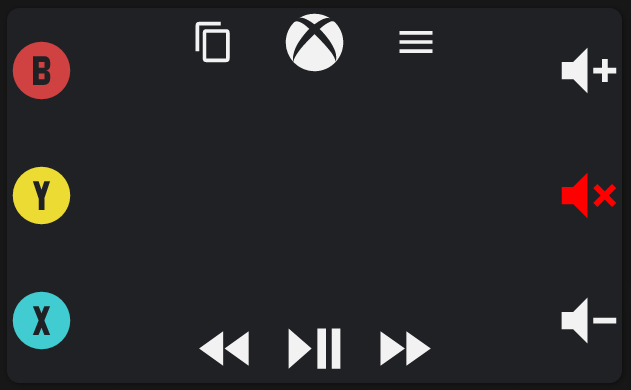

# xbox-swipe-navigation-card
Card that imitates the Xbox app's swipe gesture console remote



## Installation

### Manual Installation

1. Download the xbox-swipe-navigation-card.js file
2. Place the file in your `config/www` folder
3. Include the card code in your `ui-lovelace-card.yaml`

   ```yaml
   title: Home
   resources:
     - url: /local/button-card.js
       type: js
   ```

4. Write configuration for the card in your `ui-lovelace.yaml`


## Example Configuration
All configuration fields are currently required to be mapped to an entity action.

```type: 'custom:xbox-swipe-navigation-card'
swipe_actions:
  left: 
    service: remote.send_command
    data:
      entity_id: remote.tylers_hub
      device: Xbox
      command: DirectionLeft
  right: 
    service: remote.send_command
    data:
      entity_id: remote.tylers_hub
      device: Xbox
      command: DirectionRight
  up: 
    service: remote.send_command
    data:
      entity_id: remote.tylers_hub
      device: Xbox
      command: DirectionUp
  down:
    service: remote.send_command
    data:
      entity_id: remote.tylers_hub
      device: Xbox
      command: DirectionDown
button_actions:
  touchpad: 
    service: remote.send_command
    data:
      entity_id: remote.tylers_hub
      device: Xbox
      command: OK
  view: 
    service: remote.send_command
    data:
      entity_id: remote.tylers_hub
      device: Xbox
      command: View
  xbox: 
    service: remote.send_command
    data:
      entity_id: remote.tylers_hub
      device: Xbox
      command: Xbox
  menu: 
    service: remote.send_command
    data:
      entity_id: remote.tylers_hub
      device: Xbox
      command: Menu
  rewind:
    service: remote.send_command
    data:
      entity_id: remote.tylers_hub
      device: Xbox
      command: Rewind
  play_pause:
    service: remote.send_command
    data:
      entity_id: remote.tylers_hub
      device: Xbox
      command: Play/Pause
  fast_forward:
    service: remote.send_command
    data:
      entity_id: remote.tylers_hub
      device: Xbox
      command: FastForward
  b: 
    service: remote.send_command
    data:
      entity_id: remote.tylers_hub
      device: Xbox
      command: B
  y: 
    service: remote.send_command
    data:
      entity_id: remote.tylers_hub
      device: Xbox
      command: 'Y'
  x: 
    service: remote.send_command
    data:
      entity_id: remote.tylers_hub
      device: Xbox
      command: X
  volume_up: 
    service: media_player.volume_up
    hold_repeat_enabled: true
    data:
      entity_id: media_player.receiver
  volume_mute: 
    service: remote.send_command
    data:
      entity_id: remote.tylers_hub
      device: Receiver
      command: Mute
  volume_down: 
    service: media_player.volume_down
    hold_repeat_enabled: true
    data:
      entity_id: media_player.receiver
```
